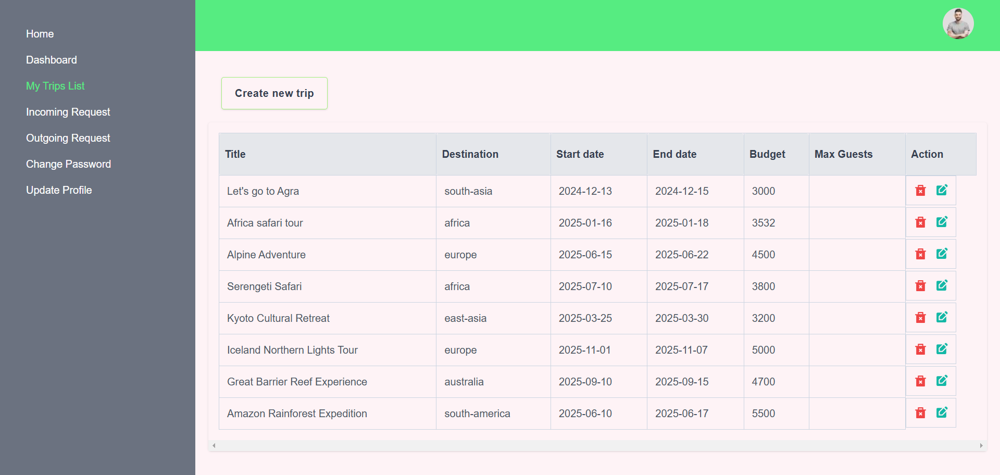
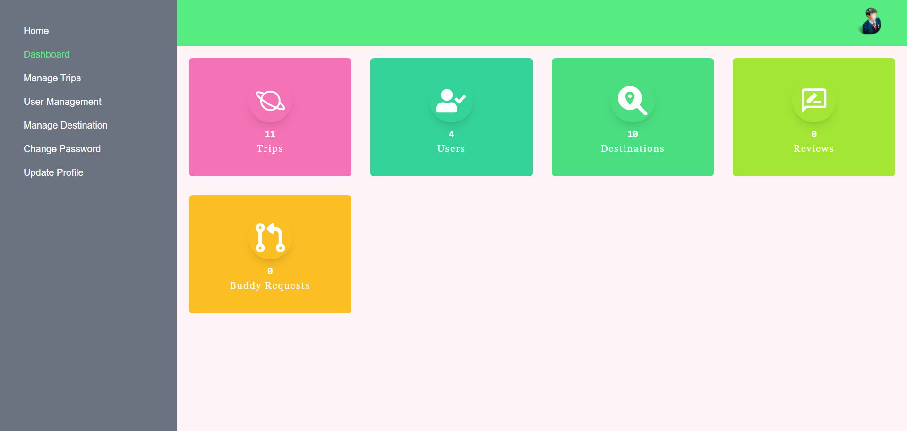

# TripMate 🚀

A user-friendly platform where travelers can create trips, request for trip mates, manage trips, and share reviews. The platform provides features for users to manage their trips seamlessly from a personal dashboard.

# Features ✨

#### Common Features

-   Explore Popular Trips
-   Discover the most popular trips based on ratings and user reviews.
-   Browse the latest trips added to the platform.

#### User Features 🧑‍💻

**1. Dashboard Management**

-   Users can manage their trips: create, edit, and delete.
-   View and respond to incoming trip-mate requests.
-   Track outgoing requests sent to join other trips.
-   Update personal profile information.
-   Share trip reviews and ratings after completion.

**2. Advanced Filtering Options**

-   Filter by Destination: Explore trips by continent or specific destinations.
-   Filter by Title or Price Range: Narrow down trips based on a title keyword and minimum-maximum price ranges.

**3. Sorting**

-   Sort trips by:
    -   Title (alphabetical order)
    -   CreatedAt (recently added trips)
    -   Price (ascending/descending)
    -   Rating (user reviews)
    -   Freshly Added Trips

**4. Pagination**

-   Optimized page navigation for a seamless user experience.

#### Admin Features 🔑

**1. Trip and Review Management**

-   Admins can view, edit, or delete all trips and user reviews.

**2. Destination Management**

-   Only admins can create, update, or delete official destinations.

**3. User Overview**

-   View all registered users and manage their activities.

**4. Admin Profile Update**

-   Admins can update their personal profile information.

**5. Overall Dashboard Overview**

-   Access a complete overview of trips, reviews, and user activities.

## Tech Stack 🛠️

-   Frontend: Next.js, TypeScript, TailwindCSS
-   Backend: Node.js, Express.js
-   Database: MongoDB with Mongoose
-   State Management: Redux Toolkit
-   Authentication: JWT
-   Authorization: Role-based access control (RBAC)
-   Pagination & Filtering: Efficient API querying
-   Deployment: Vercel

## Installation ⚙️

Follow these steps to set up the project locally:

1. Clone the repository:

```bash
    git clone https://github.com/NiharMondal/trip-mate
```

2. Navigate to the project folder:

```bash
    cd trip-mate
```

3. Install dependencies:

```bash
    npm install
```

4. Set up environment variables:

-   Create a **.env.local** file in the root directory.
-   Add the required environment variables:

```env
    NEXT_PUBLIC_BACKEND_URL = "http://localhost:5000/api/v1"
```

5. Start the development server:

```bash
    npm run dev
```

6. Access the app at http://localhost:3000.

## Screenshots 📸

**Home Page**

**User Dashboard**


**Admin Dashboard**

